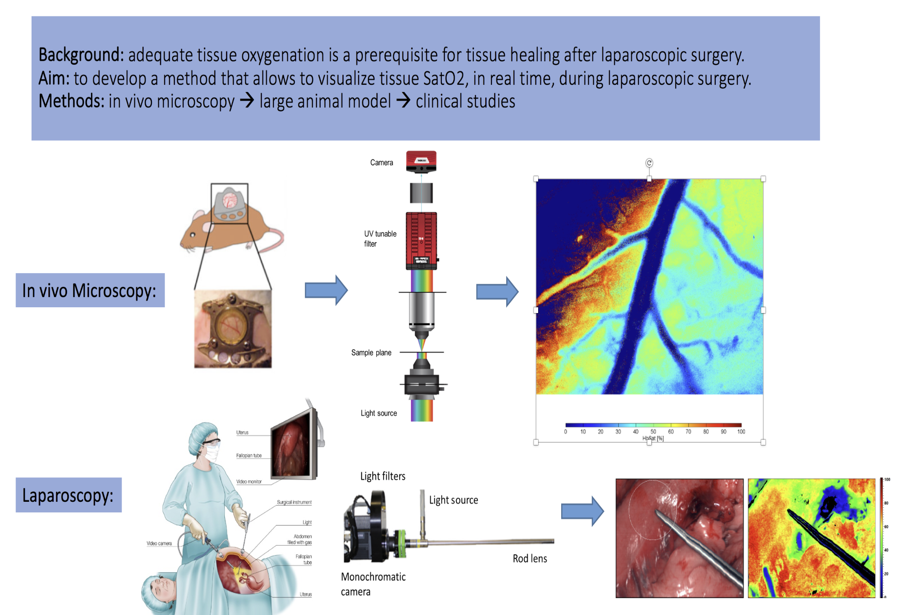

# 🌈 49591: Hyperspectral and Multispectral Image Analysis for Measuring Tissue Oxygenation Levels

> ### ⚡ Quick Look
> **The Problem:** Traditionally, tissue oxygenation is measured using invasive probes, which cause tissue trauma and sample only a small volume. We want to do it non-invasively using reflected light information and tissue proporties.
> 
> **The Tech:** Multispectral imaging setup and image processing techniques.

---

### 📸 Visualizing the Concept

---

### 📋 Official Thesis Details

| Key Information | Details |
| :--- | :--- |
| **Promotors** | dr. ir. Danilo Babin, prof. dr. Niki Rashidian |
| **Supervisors** | dr. ir. Danilo Babin, ir. Robbe De Muynck |
| **Contact** | [📩 dr. ir. Danilo Babin](mailto:danilo.babin@UGent.be?cc=rodmuync.DeMuynck@UGent.be&subject=MSc%20Thesis%20Topic%2049591:%20Spectral%20imaging%20for%20measuring%20tissue%20oxygenation) |

**Keywords:** Hyperspectral imaging, Image processing, Tissue oxygen saturation level

#### Problem statement
Tissue oxygenation is of major importance in many physiological and disease mechanisms, including wound healing and cancer behavior.
Traditionally, tissue oxygenation is measured using invasive probes, which cause tissue trauma and sample only a small volume.
Recently, hyperspectral imaging has emerged as a promising non-invasive tool to quantify tissue oxygen saturation in vivo.

#### Objectives
The aim of this project is twofold:
1. **Develop multispectral imaging setup:** Using a conventional RGB camera with light sources of varying wavelengths and light filters.
Compare the setup to hyperspectral imaging setup by quantifying tissue oxygenation on human volunteers.
Compare the setup to RGB image acquisition to determine to what extent RGB imaging can be used in tissue oxygenation measurements. 
2. **Develop image processing methods:** Extract oxygen saturation information (from hyperspectral, multispectral and RGB data), using the **Beer-Lambert law**:
   $$I = I_0 e^{-\mu L}$$
The developed method will then be calibrated using blood samples with a known pO2.
Finally, experiments on arms (with and without cuff) of human volunteers will be performed to verify whether changes in tissue oxygenation can be detected and quantified. 

**Location:** Technicum, UZ Gent, at home

---
[Back to MSc topics overview](../README.md) | [📧 Reach out about this topic](mailto:danilo.babin@UGent.be?cc=rodmuync.DeMuynck@UGent.be&subject=MSc%20Thesis%20Topic%2049591:%20Spectral%20imaging%20for%20measuring%20tissue%20oxygenation)
