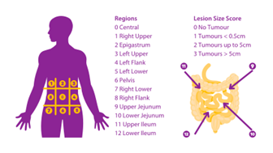

# 🏥 50146: Mapping laparoscopic video and preoperative CT

> ### ⚡ Quick Look
> **The Problem:** Surgeons score cancer spread (PCI) visually, which is subjective. This topic is situated within a research line towards more objective PCI scoring.
> By mapping 3D CT data and 2D surgical video, you'll investigate how pre-operative anatomical structure can support intra-operative organ and region identification.
> **The Tech:** Foundation Models (TotalSegmentator, SAM), Depth-from-video, and Cross-modal registration.

---

### 📸 Visualizing the concept

---

### 📋 Official Thesis Details

| Key Information | Details |
| :--- | :--- |
| **Promotor(s)** | dr. ir. Danilo Babin, prof. dr. Wouter Willaert |
| **Supervisor(s)** | ir. Robbe De Muynck, dr. ir. Danilo Babin |
| **Contact** | [📩 Robbe De Muynck](mailto:rodmuync.DeMuynck@UGent.be?subject=MSc%20thesis%20topic%2050146:%20Mapping%20laparoscopic%20video%20and%20preoperative%20CT) |

**Keywords:** surgical artificial intelligence, computer vision, medical imaging
**Collaboration:** UZ Gent (Promotor, Use Case)

#### Background
During staging laparoscopy for peritoneal metastasis, surgeons assign a **Peritoneal Cancer Index (PCI)** score by visually inspecting 13 abdominal regions and estimating both lesion presence and lesion size.
This scoring is subjective and depends on the surgeon’s expertise.
Familiarity with the anatomy and intra-operative viewing angles is necessary for a PCI scoring system to support an oncologic surgeon with anatomically grounded reasoning.

At the same time, patients routinely undergo **pre-operative CT imaging**, which contains rich anatomical information.
Modern **foundation models** can segment abdominal organs on CT with minimal supervision, enabling structured anatomical priors for PCI scoring.
However, linking laparoscopic video to CT anatomy remains difficult due to deformable tissue geometry, varying viewpoints, and the absence of a unified coordinate system.

A method that associates **regions in pre-operative CT** with **locations in laparoscopic video** could support more consistent PCI scoring and help contextualize lesions in anatomically relevant regions.

#### Problem Setting
Bridging pre-operative CT and laparoscopic video requires solving several interconnected subproblems:
1. **Segmentation of CT** using foundation models (TotalSegmentator, nnUNet, SAM-based variants).
2. **Approximate localization of camera viewpoint and organ visibility** in laparoscopic video using computer vision techniques (keypoints, depth‑from‑video, or region‑level cues).
3. **Association of CT‑defined regions to video frames**, to classify which PCI region is likely visible at a given moment.

The thesis topic investigates **how pre-operative anatomical structure can support intra-operative organ and region identification**,
a missing piece in objective PCI scoring.

#### Objectives
Develop and evaluate a computational pipeline that leverages **CT organ segmentation** and **laparoscopic video cues**
(e.g., organ segmentation and depth estimation) to estimate which PCI regions are visible during different phases of staging laparoscopy.
The project contributes to the long-term goal of **more objective and reproducible PCI scoring**.

In this research project, the student will:
* **Segment organs on CT** using foundation models and validate the consistency of region boundaries.
* **Extract region-level cues from laparoscopic video**, such as organ segmentation, depth approximations from video, or geometric keypoints.
* **Design a region-mapping strategy** that associates CT-defined regions with video frames (classification of “region in view”).
* **Evaluate feasibility** of PCI-region identification in an in-house dataset of laparoscopies and CT scans.

#### Expected Outcome
A proof-of-concept pipeline that indicates which PCI regions are in view during staging laparoscopy by combining CT-derived anatomical information with laparoscopic video cues. The result contributes to a more structured PCI scoring workflow and lays groundwork for region-aware guidance tools in peritoneal metastasis surgery.

#### References for figures
Pseudomyxoma Survivor. (2023). FAQ: What is the PCI score? https://www.pseudomyxomasurvivor.org/faq-what-is-the-pci-score/
Pinnapu, S., & Giduthuri, S. (2024). Celebrating open science and enterprise AI innovation on MONAI’s 5th anniversary. NVIDIA Technical Blog. https://developer.nvidia.com/blog/celebrating-open-science-and-enterprise-ai-innovation-on-monais-5th-anniversary/

---
[Back to MSc topics overview](../README.md) | [📧 Reach out about this topic](mailto:rodmuync.DeMuynck@UGent.be?subject=Inquiry%20regarding%20Master%20Thesis%20Topic%2050146)
